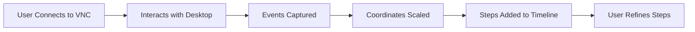
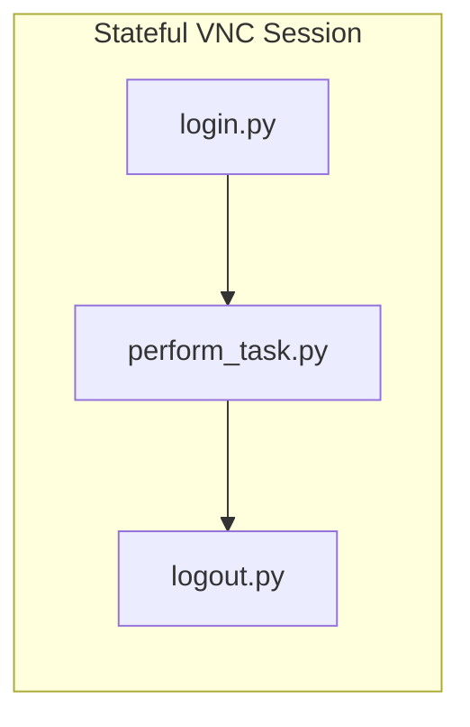
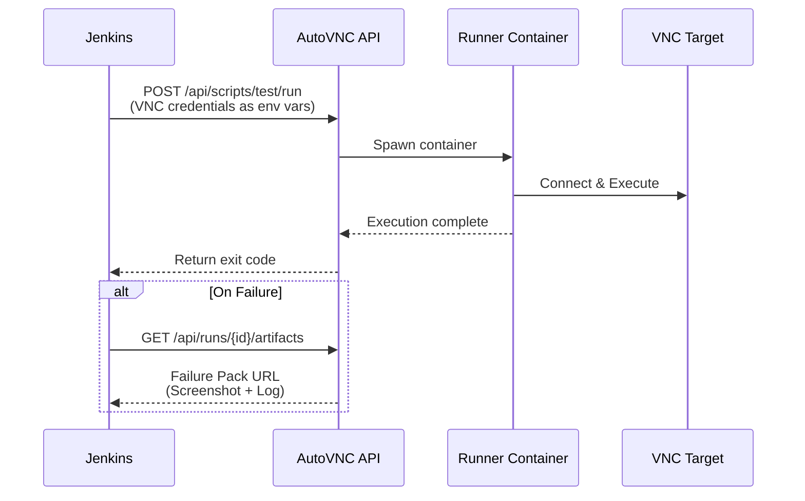

# AutoVNC - MVP Specification

> **A Docker-hosted automation IDE that records VNC interactions and converts them into modular, AI-enhanced Python scripts for Jenkins-orchestrated headless execution.**

---

## 1. Executive Summary

AutoVNC solves the complexity of automating legacy or GUI-only systems via VNC. It provides a web-based environment to:

1. **Record** a baseline interaction
2. **Refine** it using a visual step editor
3. **Enhance** it into professional Python code using an AI-powered assistant

The final scripts are executed headlessly via a REST API, making it a perfect companion for CI/CD pipelines (Jenkins).

---

## 2. System Architecture

The application is a distributed system contained within a single `docker-compose` environment.

```
┌─────────────────────────────────────────────────────────────────────────┐
│                        Docker Compose Environment                        │
├─────────────────────────────────────────────────────────────────────────┤
│                                                                          │
│  ┌──────────────────┐    ┌──────────────────┐    ┌──────────────────┐   │
│  │   Web Workshop   │◄──►│   Orchestrator   │◄──►│    The Runner    │   │
│  │    (Frontend)    │    │    (Backend)     │    │ (Headless Worker)│   │
│  │                  │    │                  │    │                  │   │
│  │  • React SPA     │    │  • FastAPI       │    │  • pyVNC         │   │
│  │  • noVNC Viewer  │    │  • Websockify    │    │  • OpenCV        │   │
│  │  • Step Timeline │    │  • AI Bridge     │    │  • Tesseract     │   │
│  │  • Monaco Editor │    │  • Script Mgmt   │    │  • Xvfb          │   │
│  └──────────────────┘    └────────┬─────────┘    └──────────────────┘   │
│                                   │                                      │
│                          ┌────────▼─────────┐                           │
│                          │   Data Volume    │                           │
│                          │                  │                           │
│                          │  • .py scripts   │                           │
│                          │  • .json metadata│                           │
│                          │  • .png templates│                           │
│                          └──────────────────┘                           │
└─────────────────────────────────────────────────────────────────────────┘
```

### 2.1 Core Components

| Component | Technology | Responsibilities |
|-----------|------------|------------------|
| **Web Workshop** (Frontend) | React SPA | noVNC viewer, Step Timeline, Monaco Code Editor |
| **Orchestrator** (Backend) | FastAPI (Python) | Script persistence, VNC-to-WebSocket proxying (Websockify), AI Assistant bridge |
| **The Runner** (Headless Worker) | Specialized Docker Image | Execution engine with pyVNC, OpenCV, Tesseract, Xvfb |
| **Data Volume** | Persistent Storage | `.py` scripts, `.json` step metadata, `.png` image templates |

---

## 3. The Automation Workflow

### 3.1 Phase 1: High-Precision Recording (Visual Mode)



| Step | Description |
|------|-------------|
| **Interaction** | User connects to a VNC target and interacts with the remote desktop |
| **Event Capture** | System records `mousedown`, `mouseup`, and `keydown` events |
| **Coordinate Scaling** | Coordinates automatically mapped from browser CSS pixels to VNC native resolution |
| **Step Timeline** | Actions grouped into a "Step List" with drag-and-drop reordering and deletion |

#### Coordinate Scaling Formula

```
RemoteX = ClientX × (RemoteWidth / CanvasWidth)
RemoteY = ClientY × (RemoteHeight / CanvasHeight)
```

---

### 3.2 Phase 2: Vision & Sync Tools

#### ROI Selector (Region of Interest)

A crosshair tool allows the user to draw a bounding box on the viewer. This captures coordinates used for:

| Tool | Purpose |
|------|---------|
| **Wait for Text** | OCR scans only this region |
| **Wait for Image** | OpenCV looks for a pattern only in this region |

#### Dynamic Delays (Smart Waits)

Instead of static `sleep(5)` calls, users insert **Smart Waits** that poll the VNC state until a specific UI element appears.

```python
# ❌ Static delay (fragile)
time.sleep(5)

# ✅ Smart Wait (robust)
vnc.wait_for_image("login_button.png", timeout=30)
```

---

### 3.3 Phase 3: The "Eject" Pivot (Code Mode)

| Step | Description |
|------|-------------|
| **The Transition** | User clicks "Eject to Code" button |
| **Code Generation** | System generates Python script based on Visual Steps |
| **Code Mode UI** | Left Pane (Steps) disappears, replaced by Monaco Editor |
| **Python Freedom** | Users can write standard Python logic |

#### Example Generated Code

```python
def run(vnc):
    vnc.click(150, 320)
    vnc.type("admin", [Keys.TAB])
    vnc.type("password123", [Keys.ENTER])
    
    # User-added logic after ejection
    if vnc.exists("error_popup.png"):
        vnc.click("close_btn.png")
        raise Exception("Login failed")
    
    vnc.wait_for_image("dashboard.png", timeout=30)
```

---

## 4. AI Smart Assistant (Copilot Integration)

### 4.1 BYOK (Bring Your Own Key) Model

Users provide their own API key in application settings:

- **GitHub Models API Key**
- **OpenAI API Key**

> [!NOTE]
> Keys are stored securely in the backend and never exposed to the frontend.

---

### 4.2 Contextual Intelligence

When the user requests help, the backend sends a **Context Package** to the AI:

```json
{
  "script_state": "<current Python code>",
  "visual_state": ["Start Menu", "Task Bar", "CMD Prompt"],
  "library_specs": "<autovnc library documentation>"
}
```

| Context Element | Purpose |
|-----------------|---------|
| **Script State** | Current Python code in the editor |
| **Visual State** | List of text found on screen via OCR |
| **Library Specs** | `autovnc` library documentation (prevents hallucination) |

---

### 4.3 AI Features

#### Robustness Suggestions

Highlights "blind" clicks and suggests wrapping them in `wait_for_image` blocks:

```diff
- vnc.click(150, 320)  # Blind click - may fail if UI not loaded
+ if vnc.wait_for_image("login_btn.png", timeout=10):
+     vnc.click("login_btn.png")
```

#### Self-Healing

If a script fails in Jenkins, the AI compares the failure snapshot to the code and suggests a specific fix.

#### Natural Language to Code

User types a comment, AI interprets the screen and writes commands:

```python
# AI: Open the start menu and type 'CMD'
vnc.click(20, 1060)  # Start menu button
vnc.wait_for_image("start_menu_open.png")
vnc.type("CMD", [Keys.ENTER])
```

---

## 5. Script Chaining & Modularity

### 5.1 The "Stateful" Session

AutoVNC allows scripts to be **chained** so the VNC session remains active across multiple scripts.



#### Modular Library

Common actions are stored as independent modules:

| Module | Purpose |
|--------|---------|
| `login.py` | Authenticate to the system |
| `logout.py` | Safely disconnect |
| `navigate_to_settings.py` | Common navigation patterns |

#### Master Script Example

```python
def run(ctx):
    ctx.run_script("login")
    ctx.run_script("perform_task")
    ctx.run_script("logout")
```

---

## 6. API & Jenkins Orchestration

### 6.1 Headless Execution API

The Backend exposes a REST API for CI/CD integration:

| Endpoint | Method | Description |
|----------|--------|-------------|
| `/api/scripts/{name}/run` | `POST` | Trigger a headless run. Returns a `run_id` |
| `/api/runs/{id}/status` | `GET` | Returns `queued`, `running`, `success`, or `failed` |
| `/api/runs/{id}/logs` | `GET` | Returns live execution logs |
| `/api/runs/{id}/artifacts` | `GET` | Download failure pack (screenshot + log) |

---

### 6.2 Jenkins Integration



| Step | Description |
|------|-------------|
| **Trigger** | Jenkins sends a `POST` request with VNC credentials as environment variables |
| **Execute** | AutoVNC spawns a Runner container |
| **Report** | Upon completion, AutoVNC returns the exit code |
| **Artifacts** | On failure, AutoVNC provides a URL to download a "Failure Pack" |

---

## 7. Technical Specifications

### 7.1 Backend (Python/FastAPI)

| Component | Technology | Notes |
|-----------|------------|-------|
| **VNC Proxy** | Custom WebSocket-to-TCP bridge | Enables noVNC viewer connectivity |
| **Task Management** | Simple task queue | Manages concurrent headless runs |
| **API Framework** | FastAPI | OpenAPI documentation auto-generated |

---

### 7.2 Python Library (`autovnc`)

Generated scripts rely on a high-level helper library:

```python
# Click Operations
vnc.click(x, y)                          # Click at coordinates
vnc.click("template.png")                # Click on image match

# Keyboard Operations
vnc.type("text", [keys])                 # Type text with optional key modifiers

# Wait Operations
vnc.wait_for_text("string", timeout, region)      # Wait for OCR text match
vnc.wait_for_image("image.png", threshold, region) # Wait for image template match

# Utility Operations
vnc.exists("template.png")               # Check if image exists on screen
vnc.screenshot()                         # Capture current screen
vnc.get_text(region)                     # OCR a specific region
```

---

### 7.3 Data Storage Structure

```
/data
├── /scripts
│   ├── my_test.py              # The Ejected Python Code
│   └── my_test.json            # Step List metadata (for visual mode)
│
├── /templates
│   └── my_test/                # OpenCV image snippets
│       ├── btn_login.png
│       ├── dashboard.png
│       └── error_popup.png
│
└── /runs
    └── run_455/                # Logs and failure snapshots
        ├── failure.png
        └── execution.log
```

---

## 8. Acceptance Criteria (MVP Done)

> [!IMPORTANT]
> All criteria must pass for MVP to be considered complete.

| # | Criteria | Validation |
|---|----------|------------|
| 1 | **Recording** | User can record mouse/keyboard and see them as visual blocks |
| 2 | **Refinement** | User can change a "Click" coordinate in the UI and save |
| 3 | **Ejection** | User can convert blocks to Python and add an `if/else` statement |
| 4 | **AI Assistant** | User can highlight code and receive a valid "Robustness" suggestion via API |
| 5 | **Headless Run** | A script can be triggered via `curl` and execute without a browser window open |
| 6 | **Persistence** | All scripts and image templates survive a Docker container restart |

### Validation Commands

```bash
# Test Headless Execution (Criteria #5)
curl -X POST http://localhost:8080/api/scripts/my_test/run \
  -H "Content-Type: application/json" \
  -d '{"vnc_host": "192.168.1.100", "vnc_port": 5900, "vnc_password": "secret"}'

# Check Run Status
curl http://localhost:8080/api/runs/{run_id}/status

# Verify Persistence (Criteria #6)
docker-compose down && docker-compose up -d
ls /data/scripts/  # Scripts should still exist
```

---

## 9. Future Roadmap (Post-MVP)

| Priority | Feature | Description |
|----------|---------|-------------|
| 🔴 High | **Video Playback** | Record a `.mp4` of every automation run for debugging. Only persist recordings for failed runs to save storage. |
| 🟠 Medium | **Self-Healing AI** | Automatic script adjustment when UI elements move slightly. AI analyzes failure screenshots and updates coordinates/templates. |
| 🟡 Low | **Multi-User Support** | Role-based access control for teams |
| 🟡 Low | **Script Versioning** | Git-like history for automation scripts |
| 🟢 Future | **Scheduled Runs** | Built-in cron-style scheduler (alternative to Jenkins) |

---

## Appendix A: Docker Compose Structure

```yaml
version: '3.8'

services:
  frontend:
    build: ./frontend
    ports:
      - "3000:3000"
    depends_on:
      - backend

  backend:
    build: ./backend
    ports:
      - "8080:8080"
    volumes:
      - data:/data
    environment:
      - AI_API_KEY=${AI_API_KEY}

  runner:
    build: ./runner
    # Spawned dynamically by backend

volumes:
  data:
    driver: local
```

---

## Appendix B: Technology Stack Summary

| Layer | Technology |
|-------|------------|
| **Frontend** | React, noVNC, Monaco Editor |
| **Backend** | Python, FastAPI, Websockify |
| **Runner** | Python, pyVNC, OpenCV, Tesseract, Xvfb |
| **Container** | Docker, Docker Compose |
| **CI/CD Integration** | REST API, Jenkins |
| **AI** | OpenAI API / GitHub Models (BYOK) |

---

*Document Version: 1.0 (MVP)*  
*Last Updated: January 2026*
