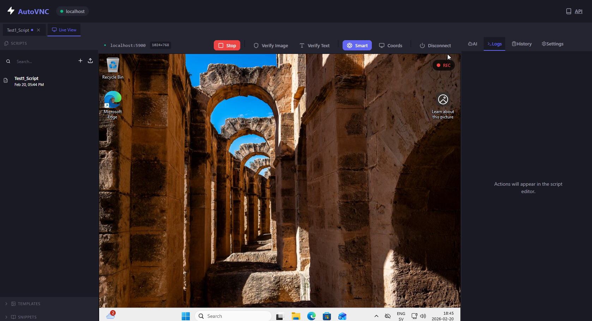

# AutomateVNC: Visual Automation IDE

AutomateVNC is a IDE for building VNC automation. Record your interactions, refine the Python scripts, and orchestrate them for headless execution.



---

### Open Source Credits

AutomateVNC is built on top of the following technologies:

*   **OpenCV**: Powering our image processing and template matching. 
*   **Tesseract OCR**: Providing text recognition and fuzzy matching. 
*   **noVNC**: The core technology enabling VNC in the browser. 
*   **Monaco Editor**: The same engine that powers VS Code. 
*   **VNCdotool**: The bridge for high-level VNC interactions. 

---

### Quick Start

1. **Setup**
   ```bash
   git clone https://github.com/mfdoom84/automatevnc.git
   cd AutomateVNC
   cp .env.example .env
   ```

2. **Launch**
   ```bash
   docker compose up -d
   ```

3. **Links**
   - **Web UI**: [http://localhost:3000](http://localhost:3000)
   - **API Docs**: [http://localhost:8080/docs](http://localhost:8080/docs)

---

### Key Capabilities

*   **Native Recording**: Record every click, navigation and typing directly on the VNC screen. Code generation is handled automatically.
*   **Computer Vision**: Supports image template matching with cursor exclusion and OCR with fuzzy matching. This allows scripts to find text even if character recognition is slightly distorted.
*   **Integrated Editor**: A Monaco-powered editor with a Snippet Library for loops, conditional logic, and advanced VNC actions.
*   **AI Support**: Integrated assistance for code reviews, robustness improvements, and failure analysis.
*   **Headless Ready**: Designed for CI/CD pipelines. Trigger script execution via a simple REST API and receive structured logs/artifacts.

---

### Recorded scripts in editor

Recorded scripts utilize a fluent Python API for controlling the remote session.

```python
def run(vnc):
    # Example Interactions
    vnc.click("start_btn.png", hint=(100, 200)) # Target specific area
    vnc.right_click(x, y)                       # Open context menu
    vnc.double_click(500, 300)                  # Coordinated double click
    vnc.move(800, 600)                          # Mouse movement
    vnc.drag(100, 100, 200, 200)                # Smooth drag-and-drop
    vnc.scroll("down", clicks=5)                # Scroll mouse wheel
    
    # Example Inputs
    vnc.type("Hello World!")
    vnc.press("enter")
    
    # Example Assertions
    vnc.wait_for_text("Dashboard", timeout=10)
    vnc.wait_for_image("loaded_icon.png")
    
    # Example Logic
    if vnc.exists("popup.png"):
        vnc.click("close.png")
```

---

### API Headless Trigger Example

```bash
curl -X POST http://localhost:8080/api/scripts/login_test/run \
  -H "Content-Type: application/json" \
  -d '{
    "vnc": {
      "host": "10.0.0.5",
      "port": 5900,
      "password": "vnc_password"
    }
  }'
```

---

### Configuration (.env)

| Variable | Default | Purpose |
| :--- | :--- | :--- |
| `FRONTEND_PORT` | `3000` | Web UI Port |
| `BACKEND_PORT` | `8080` | API & Documentation Port |
| `AI_PROVIDER` | `openai` | AI Service (openai/github) |
| `DATA_DIR` | `./data` | Script and template storage |

Note: If you change ports, restart services using `docker compose up -d` to update the proxy configuration.

---

### Troubleshooting

*   **Port Conflicts**: Update `FRONTEND_PORT` or `BACKEND_PORT` in your `.env` file.
*   **CORS Issues**: Ensure the browser URL matches the configured `FRONTEND_PORT`.
*   **System Logs**: Use `docker compose logs -f backend` for real-time monitoring.

---

### License

AutomateVNC is released under the [MIT License](LICENSE). 

---